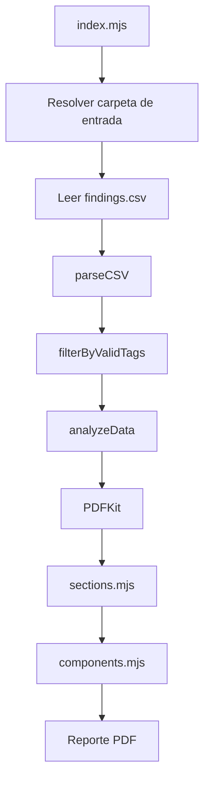

# Generador de Reporte de Vulnerabilidades

CLI en Node.js que analiza un archivo `findings.csv` y genera un reporte PDF ejecutivo/técnico de vulnerabilidades.

El proyecto está orientado a reportes por carpeta o sprint dentro de `data/`. Por defecto usa `data/Ejemplo/findings.csv` y escribe el PDF resultante en la misma carpeta de entrada.

## Stack

| Pieza | Uso |
| --- | --- |
| Node.js ESM | Runtime y módulos nativos |
| PDFKit | Renderizado del PDF |
| PapaParse | Lectura y parseo del CSV |

## Instalación

```bash
npm install
```

## Uso

```bash
# Usa data/Ejemplo/findings.csv
npm start

# Usa data/<Carpeta>/findings.csv
npm run analyze -- "Sprint 245"

# Equivalente directo
node index.mjs "Sprint 245"
```

El archivo generado queda en:

```text
data/<Carpeta>/Reporte_Vulnerabilidades_<Carpeta>.pdf
```

## Validación

```bash
npm run check
node index.mjs
```

`npm run check` valida sintaxis de los módulos principales. `node index.mjs` ejecuta el flujo completo con la carpeta `Ejemplo` y genera el PDF.

## Estructura

```text
data/
  Ejemplo/
    findings.csv
src/
  config/
    index.mjs
  pdf/
    components.mjs
    sections.mjs
  services/
    data.mjs
index.mjs
package.json
```

## Flujo interno



## Secciones del PDF

| Sección | Contenido |
| --- | --- |
| Portada | Totales, severidades y valores únicos de `product_type` |
| 01 Resumen Ejecutivo | KPIs y distribución por severidad |
| 02 Análisis por Tipo de Vulnerabilidad | Diagrama de barras por tag y descripción de tipos |
| 03 Análisis por Servicio y Severidad | Tres tablas por grupo: `fluidattacks`, `c2c` y `engines` |
| 04 Prioridades Accionables | Vulnerabilidades priorizadas por severidad, CVSS, EPSS, SLA, ambiente y mitigación |
| 05 Detalle de Vulnerabilidades | Hallazgos agrupados por servicio |

## Campos relevantes del CSV

El analizador usa, entre otros, estos campos cuando existen:

| Campo | Uso |
| --- | --- |
| `tag` | Clasificación principal del hallazgo |
| `product_type` | Producto mostrado en portada |
| `engagement` | Servicio o aplicación afectada |
| `severity` | Nivel de severidad |
| `cvss_score` | Priorización técnica |
| `epss` / `epss_percentile` | Probabilidad de explotación |
| `sla_days_remaining` | Urgencia por SLA |
| `environment` | Contexto operativo |
| `mitigation` | Cobertura de remediación |
| `component` / `version` | Dependencia o componente vulnerable |
| `file_path` | Ubicación técnica del hallazgo |

Si un campo no está presente o viene vacío, el código aplica valores por defecto seguros para evitar romper la generación del PDF.

## Grupos de tags

La sección 03 agrupa los hallazgos así:

| Grupo | Tags incluidos |
| --- | --- |
| `fluidattacks` | `fluidattacks` |
| `c2c` | `c2c` |
| `engines` | `engine_dependencies`, `engine_container`, `engine_iac`, `black_list; engine_dependencies` |

La configuración central de grupos está en `src/config/index.mjs`.

## Archivos clave

| Archivo | Responsabilidad |
| --- | --- |
| `index.mjs` | Orquesta entrada, análisis y generación del PDF |
| `src/services/data.mjs` | Parseo, limpieza, filtros y agregados del CSV |
| `src/pdf/sections.mjs` | Renderizado de secciones del reporte |
| `src/pdf/components.mjs` | Componentes visuales reutilizables de PDFKit |
| `src/config/index.mjs` | Tema visual, metadatos, severidades y grupos de tags |

## Notas de mantenimiento

- Los PDFs generados están ignorados por Git.
- El CSV de ejemplo `data/Ejemplo/findings.csv` sí queda versionado para pruebas locales.
- Antes de subir cambios, ejecutar `npm run check` y `node index.mjs`.
- Si se cambia la estructura del CSV, revisar primero `src/services/data.mjs` y después las secciones que consumen esos agregados.
